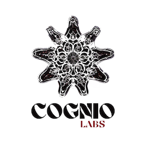
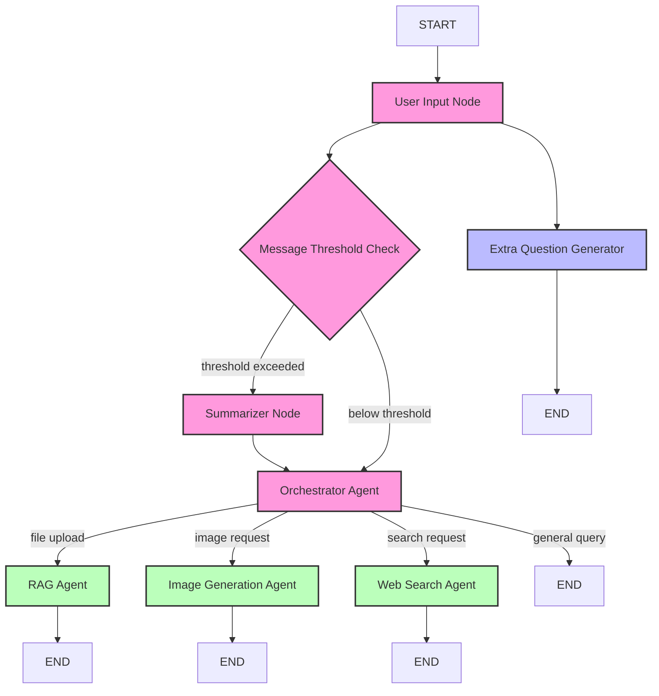

<div align="center">
  
</div>

# Vaani.pro - Intelligent Agentic Chatbot Platform

<p align="center">
  
</p>

<p align="center">
  <strong>An intelligent agentic chatbot platform by Cognio Labs.</strong>
</p>

## 🌟 Overview

Vaani.pro is a sophisticated conversational AI platform built on a modular agentic workflow. The system employs a central orchestrator that intelligently routes user queries to specialized agents, each optimized for specific tasks such as document analysis, image generation, and web search.

## 🔍 Key Features

- **Intelligent Query Routing**: Automatically directs user queries to the most appropriate specialized agent
- **Document Analysis (RAG)**: Process PDF, DOC, and TXT files to answer document-specific questions
- **Image Generation**: Create custom images based on user requests
- **Web Search**: Fetch real-time information from the internet
- **Contextual Understanding**: Maintains conversation context through intelligent summarization
- **Parallel Processing**: Generates follow-up questions while processing main queries

## 🛠️ Architecture

Vaani.pro is built using LangGraph, enabling a sophisticated directed graph architecture of interconnected agents:



## 🚀 Getting Started

### Prerequisites

- Python 3.9+
- Required API keys:
  - Groq API key (for LLM access)
  - Google API key (for Gemini model)
  - Replicate API token (for image generation)
  - Tavily API key (for web search)
  - Qdrant (for vector database)

### Installation

1. Clone the repository
```bash
git clone https://github.com/cogniolabs/vaani-pro.git
cd vaani-pro
```

2. Install dependencies
```bash
pip install -r requirements.txt
```

3. Set up environment variables
```bash
cp .env.example .env
# Edit .env with your API keys
```

4. Run the application
```bash
python -m my_agent.agent
```

## 🧩 Project Structure

```
vaani_pro/
├── my_agent/                # Main package
│   ├── utils/               # Utility modules
│   │   ├── __init__.py
│   │   ├── tools.py         # Tools for specialized tasks
│   │   ├── nodes.py         # Node functions for the graph
│   │   └── state.py         # State definition
│   ├── __init__.py
│   └── agent.py             # Main graph implementation
├── .env                     # Environment variables
├── requirements.txt         # Dependencies
└── langgraph.json           # LangGraph configuration
```

## 💻 Usage Examples

### Basic Conversation
```python
from my_agent.agent import vaani_graph

graph = vaani_graph()

# Start a conversation
result = graph.invoke({
    "user_input": "Tell me about artificial intelligence",
    "chat_history": []
})

print(result.chat_history[-1].content)  # Print the AI's response
```

### Document Analysis
```python
result = graph.invoke({
    "user_input": "What are the key points in this document?",
    "file_url": "path/to/document.pdf",
    "chat_history": []
})
```

### Image Generation
```python
result = graph.invoke({
    "user_input": "Create an image of a futuristic city with flying cars",
    "chat_history": []
})

# Access generated image paths
image_paths = result.image_urls
```

## 🔧 Extending Vaani.pro

### Adding a New Specialized Agent

1. Define the agent node function in `my_agent/utils/nodes.py`:
```python
def new_agent_node(state: VaaniState) -> Dict:
    """Implement your specialized agent logic here."""
    # Process state and generate response
    return {
        "agent_name": "output",
        "chat_history": updated_chat_history,
        # Additional state updates
    }
```

2. Add the node to the graph in `my_agent/agent.py`:
```python
workflow.add_node("new_agent", new_agent_node)
```

3. Update the orchestrator's routing logic:
```python
workflow.add_conditional_edges(
    "orchestrator",
    lambda state: state.agent_name,
    {
        # Existing routes
        "new_agent": "new_agent",
        # ...
    }
)
```

4. Add an edge from your new agent to END:
```python
workflow.add_conditional_edges(
    "new_agent",
    lambda state: state.agent_name,
    {
        "output": END
    }
)
```

## 📝 API Documentation

### VaaniState

```python
class VaaniState(BaseModel):
    user_input: str
    deep_research: bool
    chat_history: List[BaseMessage]
    agent_name: str
    file_url: Optional[str]
    task_description: str
    extra_question: str
    messages: List[BaseMessage]
    summary: str
    # Additional fields
```

### Core Functions

- `vaani_graph()`: Creates and returns the main workflow graph
- `user_input_node(state)`: Processes user input
- `orchestrator_node(state)`: Routes queries to specialized agents
- `summarize_chat_history(state)`: Maintains conversation context
- `rag_agent_node(state)`: Handles document-based queries
- `image_agent_node(state)`: Generates images
- `websearch_agent_node(state)`: Searches the web for information
- `extra_questions_node(state)`: Generates related follow-up questions

## 🧪 Testing

Run the automated test suite:

```bash
pytest tests/
```

## 🔮 Future Roadmap

- Voice interface integration
- Multi-modal input processing
- Fine-tuned domain-specific agents
- Enterprise authentication and user management
- Enhanced context management with long-term memory

## 🤝 Contributing

Contributions are welcome! Please feel free to submit a Pull Request.

## 👥 Team

- **Ashutosh Upadhyay** - AI 
- **Shivam Upadhyay** - Frontend & API Development

Both from [Cognio Labs](https://cogniolabs.com)

## 📄 License

This project is licensed under the MIT License - see the LICENSE file for details.

## 📊 Benchmarks

Vaani.pro has been benchmarked against leading conversational AI platforms, showing superior performance in context management and specialized task processing.


## 🙏 Acknowledgements

- LangChain & LangGraph teams for the excellent frameworks
- Groq for high-performance LLM infrastructure
- Replicate for the image generation capabilities